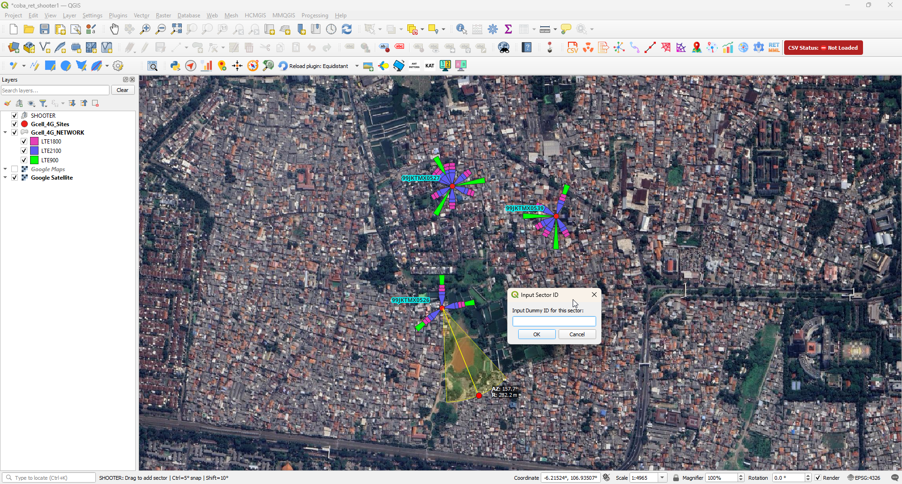

# Shooter  
### Engineering-Grade Sector Geometry & RF Planning Toolkit for QGIS

Shooter is a professional QGIS plugin designed for RF engineers, telecom planners, and GIS analysts who require structured manual sector and site creation within controlled spatial workflows.

Unlike generic drawing tools, Shooter provides engineering-aware geometry handling for sector creation, azimuth control, and multi-sector site structuring.

Released under the GNU General Public License v3.0.

---

## 🚀 Overview

In RF and NPI planning workflows, sector and site proposal activities are often executed manually without structured geometric constraints.

Shooter introduces a controlled engineering workflow that allows users to:

- Create sites with structured attributes
- Generate sectors with defined azimuth
- Maintain consistent geometric behavior
- Edit sector orientation safely
- Manage site-sector relationships cleanly

The plugin is built to behave as a stable engineering utility — not an experimental drawing script.

---

## 🎯 Core Capabilities

- Manual Site Creation Tool
- Manual Sector Creation Tool
- Controlled Azimuth Handling
- Multi-Sector Site Support
- Interactive Sector Editing
- Structured Layer Management
- RF-Oriented Geometry Logic

---

## 📸 Workflow Overview

The plugin operates in a structured three-step workflow:

---

### 1️⃣ Add Mode Selection

Choose whether to create a manual sector or generate a structured 3-sector site.

---

### 2️⃣ Manual Sector Creation

Drag-based azimuth definition with controlled orientation logic.

- Real-time azimuth display
- Radius visualization
- Snap control support

---

### 3️⃣ 3-Sector Site Generation

Automatically generate a structured 3-sector configuration with controlled spacing and orientation.

---
### 1️⃣ Add Site

Create a new RF site location with controlled layer handling.

---

### 2️⃣ Add Sector

Generate sector geometry with defined azimuth orientation.

Supports:
- Single sector creation
- Multi-sector (3-sector) configuration
---

### 3️⃣ Edit & Adjust

Modify azimuth direction and sector geometry while maintaining structural integrity.

---

## 🧠 How It Works

1. User creates or selects a site.
2. Sector geometry is generated based on azimuth input.
3. Geometry is computed with controlled orientation logic.
4. Structured attributes are maintained inside QGIS layers.
5. Edits are handled through controlled dialog interaction.

The plugin ensures predictable geometry behavior within planning workflows.

---

## 🛠 Technical Architecture

- Designed for QGIS 3.22+
- CRS-aware geometry handling
- Toolbar lifecycle-safe implementation
- Context menu integration
- Structured layer management
- Clean memory-layer control

Shooter is engineered to operate reliably inside professional telecom planning environments.

---

## 🧩 Use Cases

- RF site proposal planning
- NPI sector drafting
- LTE / NR azimuth validation support
- Pre-deployment geometry simulation
- Manual sector layout engineering

---

---

## ⚠️ Disclaimer

This plugin supports engineering workflows and should be used within professional RF planning and spatial analysis contexts.
---
This project is released under the GNU General Public License v3.0.

## ⚖️ License

## 👨‍💻 Author

Achmad Amrulloh
